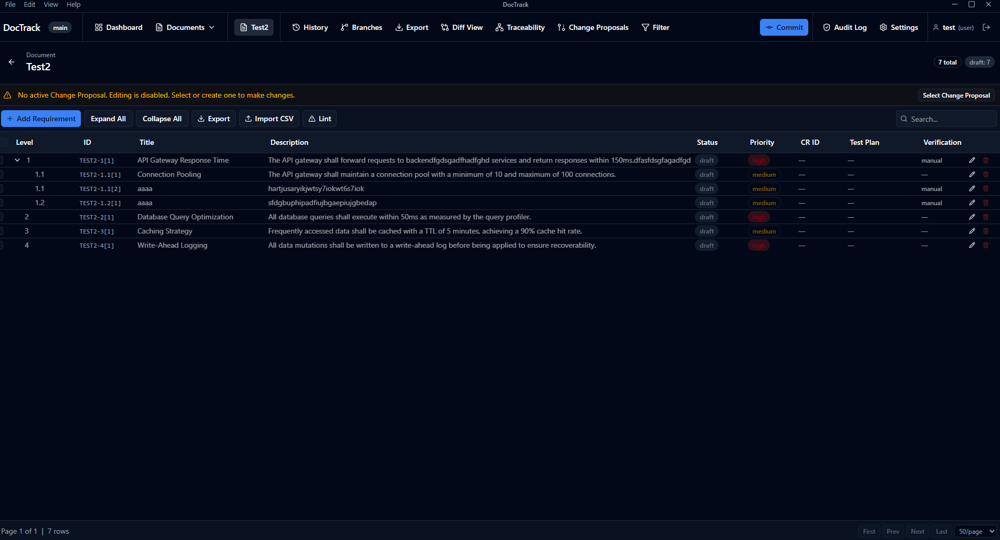

# DocTrack - Document Requirements Tracker

A professional desktop application for managing requirements documents with git-like version control, hierarchical flowdown, and deep OneDev integration.

**Status**: Actively developed. 

Features include branching, traceability, change proposals, audit logging, rich text editing, CSV import/export, and [OneDev](https://github.com/theonedev/onedev) issue/build/commit/PR linking.




---

## Architecture: Python + Electron Hybrid

```
┌────────────────────────────────────────────────┐
│         Electron Desktop Application           │
│                                                │
│  ┌──────────────────────────────────────────┐ │
│  │  React + TypeScript Frontend             │ │
│  │  (shadcn/ui, Tailwind CSS, Vite)         │ │
│  │  HTTP requests → localhost:5000/api      │ │
│  └──────────────┬──────────────────────────┘ │
│                 │                             │
│  ┌──────────────▼──────────────────────────┐ │
│  │  Python Flask Backend (subprocess)      │ │
│  │  • REST API endpoints                   │ │
│  │  • Business logic & document processing │ │
│  │  • OneDev proxy (token stays server)    │ │
│  └──────────────┬──────────────────────────┘ │
│                 │                             │
│  ┌──────────────▼──────────────────────────┐ │
│  │  SQLite Database (local file)           │ │
│  │  ~/.doctrack/doctrack.db                │ │
│  └─────────────────────────────────────────┘ │
│                                                │
└────────────────────────────────────────────────┘
```

**Why this architecture?**
- Python for core logic & document processing
- TypeScript for type-safe, reactive UI
- Electron for native desktop experience
- Local SQLite for offline capability
- Clean separation of concerns
- Easy future migration to server mode

---

## Quick Start

### Prerequisites
- **Node.js 18+** (with npm)
- **Python 3.10+**
- **Windows, macOS, or Linux**

### Installation

```bash
cd doctrack

# Install npm dependencies
npm install --legacy-peer-deps

# Install Python dependencies
pip install -r backend/requirements.txt
```

### Development

```bash
# Start everything (Electron + Flask + React dev server)
npm run dev
```

**What starts:**
1. **Electron** main process → spawns Flask subprocess
2. **Flask** REST API server → http://localhost:5000
3. **Vite** React dev server → http://localhost:3000
4. **DevTools** → opens automatically for debugging

> **Note for Windows/WSL**: The app must be run from Windows (cmd/PowerShell), not WSL, because Electron binds to native Windows APIs.

### Build for Production

```bash
npm run build
```

**Output**:
- Windows: `dist/DocTrack-Setup.exe`
- macOS: `dist/DocTrack.dmg`
- Linux: `dist/DocTrack.AppImage`

---

## Features

### Core Functionality
- **Document Management**
  - Create, view, edit, delete documents
  - Track document version and status
  - Document ownership tracking

- **Requirement Management**
  - Create requirements with auto-generated IDs (per-document format: `DOC-{shortId}-{level}[{seq}]`)
  - Priority levels: High, Medium, Low
  - Status tracking: Draft → Review → Approved → Implemented → Verified
  - Verification methods (Manual, Unit Test, Integration Test, etc.)
  - Tags, rationale, and test plan info
  - Rich text descriptions via TipTap editor

- **Change Control**
  - Change Proposals (CPs) gate requirement edits
  - Select an active CP before making changes
  - Audit log tracks all actions (who, what, when)
  - Edit history with per-field diffs

- **Traceability**
  - Hierarchical requirement tree per document
  - Create traceability links between requirements (same or cross-document)
  - Impact analysis (upstream dependencies & downstream impact)
  - Visual traceability graph with pan/zoom

- **Version Control**
  - Git-like branching model
  - Commits, tags, and merge support
  - Branch comparison and diff view
  - Baselines for snapshots

- **Import / Export**
  - CSV import with template download
  - CSV, Word, and PDF export
  - Bulk operations via async API

- **OneDev Integration**
  - Link requirements to OneDev issues, builds, commits, and pull requests
  - Server-side token storage (never exposed to frontend)
  - Built-in browser/picker dialog to search and select OneDev entities
  - Configurable per-project

- **User Management**
  - Login/logout with JWT sessions
  - Role-based access (admin / user)
  - Admin-only user management panel

- **UI/UX**
  - shadcn/ui components + Tailwind CSS
  - Command palette (Ctrl+K) for quick navigation
  - Filter popovers, sorting, and global search
  - Responsive sidebar navigation
  - Inline editing in requirement tables

---

## Technology Stack

| Component | Technology | Version |
|-----------|-----------|---------|
| Desktop Framework | Electron | 26+ |
| Frontend Framework | React | 18+ |
| Frontend Language | TypeScript | 5+ |
| UI Components | shadcn/ui | latest |
| Styling | Tailwind CSS | 3+ |
| Build Tool (Frontend) | Vite | 5+ |
| Rich Text | TipTap | 2+ |
| Tables | TanStack Table | 8+ |
| Backend Framework | Flask | 2.3+ |
| Backend Language | Python | 3.10+ |
| Database | SQLite | 3 |
| HTTP Client | fetch | - |
| OneDev Proxy | requests | 2.31+ |

---

## Project Structure

```
doctrack/
├── src/
│   ├── main/                    # Electron main process
│   │   ├── main.ts              # App entry point, Flask spawning
│   │   └── preload.ts           # IPC bridge (context isolation)
│   ├── renderer/                # React frontend
│   │   ├── App.tsx              # Main component, routing, state
│   │   ├── components/          # Reusable UI components
│   │   │   ├── CSVImportDialog.tsx
│   │   │   ├── CommandPalette.tsx
│   │   │   ├── FilterPopover.tsx
│   │   │   ├── Navigation.tsx
│   │   │   ├── OneDevPickerDialog.tsx
│   │   │   ├── RequirementVersionDiff.tsx
│   │   │   ├── RichTextEditor.tsx
│   │   │   ├── TagInput.tsx
│   │   │   ├── TitleBar.tsx
│   │   │   ├── TraceabilityGraph.tsx
│   │   │   ├── TraceabilityTree.tsx
│   │   │   └── ui/              # shadcn/ui primitives
│   │   ├── pages/
│   │   │   ├── AuditLogPage.tsx
│   │   │   ├── BranchesPage.tsx
│   │   │   ├── ChangeProposalsPage.tsx
│   │   │   ├── DashboardPage.tsx
│   │   │   ├── DiffViewPage.tsx
│   │   │   ├── DocumentsPage.tsx
│   │   │   ├── ExportPage.tsx
│   │   │   ├── HistoryPage.tsx
│   │   │   ├── LoginPage.tsx
│   │   │   ├── RequirementsPage.tsx
│   │   │   ├── SettingsPage.tsx
│   │   │   └── TraceabilityPage.tsx
│   │   ├── contexts/
│   │   │   └── AuthContext.tsx
│   │   ├── lib/
│   │   │   └── utils.ts
│   │   └── utils/
│   │       └── levelTree.ts
│   ├── api/
│   │   └── api.ts               # HTTP client for Flask API
│   └── types/
│       └── index.ts             # Shared TypeScript interfaces
├── backend/                     # Python Flask server
│   ├── app.py                   # Flask routes & REST API
│   ├── database.py              # SQLite schema, migrations, business logic
│   ├── export.py                # CSV / Word / PDF export
│   ├── onedev_client.py         # OneDev API proxy client
│   ├── async_utils.py           # Async helpers
│   ├── async_demo.py            # Demo script for async batch ops
│   ├── seed_test_data.py        # Seed script for test data
│   └── requirements.txt         # Python dependencies
├── public/                      # Static assets
├── dist/                        # Build output
├── package.json                 # npm dependencies & scripts
├── tsconfig.json                # TypeScript config
├── vite.config.ts               # Vite build config
├── components.json              # shadcn/ui config
└── README.md                    # This file
```

---

## OneDev Integration Setup

1. Open **Settings → OneDev Integration**
2. Enter your OneDev server URL (e.g., `http://localhost:6610`)
3. Enter your OneDev **access token** (stored server-side only)
4. Click **Test Connection**
5. Select a default project from the dropdown
6. Save

Once configured, requirement forms show **OneDev Issue Link**, **Build Link**, and **Commit Link** fields with a **Browse** button to open the OneDev picker.

---

## Development

### Frontend (React/TypeScript)
1. Edit files in `src/renderer/`
2. Vite automatically reloads (HMR)
3. See changes instantly in Electron window

### Backend (Python/Flask)
1. Edit `backend/app.py` or `backend/database.py`
2. Flask auto-reloads on file save
3. Test via React UI or HTTP client

### Adding a new API endpoint
1. Create route in `backend/app.py`
2. Add business logic in `backend/database.py`
3. Add client function in `src/api/api.ts`
4. Add types in `src/types/index.ts` if needed

---

## Build Scripts

```bash
# Development
npm run dev              # Start Electron + Flask + Vite dev server
npm run build            # Build for production
npm run type-check       # Check TypeScript types

# Backend (standalone)
python backend/app.py    # Run Flask server directly
```

---

## Database

**Type**: SQLite3 (local file)
**Location**: `~/.doctrack/doctrack.db`

**Environment override** (useful for WSL/Windows path mismatches):
```bash
export DOCTRACK_DB_PATH=/mnt/c/Users/<username>/.doctrack/doctrack.db
```

### Key Tables
- **documents** - Project documents with version tracking
- **requirements** - Individual requirements with metadata & OneDev links
- **branches** - Git-like branches
- **commits** - Snapshot commits per branch
- **traceability_links** - Requirement-to-requirement links
- **change_proposals** - Change proposal records
- **audit_log** - Action audit trail
- **edit_history** - Per-requirement edit history
- **app_settings** - Application settings (including OneDev config)
- **users** / **sessions** - Authentication

Migrations run automatically on startup via `PRAGMA table_info` checks in `init_db()`.

---

## Troubleshooting

### Flask fails to start
```
Error: Flask not found or python not found
```
**Solution**: Install Python dependencies
```bash
pip install -r backend/requirements.txt
```

### React shows blank screen
**Solution**: Check both servers are running
- Electron console shows Flask startup
- Browser DevTools (Ctrl+I): Network tab → see API calls?
- Check Flask directly: http://localhost:5000/api/health

### Port already in use
**Solution**: Kill existing process or change ports in code

### Database locked error
**Solution**: Restart the app or delete database
```bash
rm ~/.doctrack/doctrack.db  # Will be recreated on startup
```

### npm install fails with peer dependency errors
**Solution**: Use legacy peer deps
```bash
npm install --legacy-peer-deps
```

---

## Architecture Documentation

For detailed architecture information, see:
- [**HYBRID_ARCHITECTURE.md**](HYBRID_ARCHITECTURE.md) - Comprehensive architecture guide
- [**MIGRATION_SUMMARY.md**](MIGRATION_SUMMARY.md) - Migration notes from earlier architectures

---

## Future: Server Mode

This architecture is designed for easy migration to server mode:

**Current (Local)**
```
React → Flask (local) → SQLite (local)
```

**Future (Server)**
```
React → Flask (remote) → PostgreSQL (remote)
```

Only backend changes needed - UI stays the same!

---

## License

MIT

---

## Contact & Support

For questions, issues, or feature requests:
- Check the troubleshooting section above
- Review [HYBRID_ARCHITECTURE.md](HYBRID_ARCHITECTURE.md) for detailed technical info

---

**Last Updated**: April 2026
**Architecture**: Hybrid (Python 3.10+ + Node.js + Electron)
**Status**: Feature-complete for core requirements management, actively enhanced
